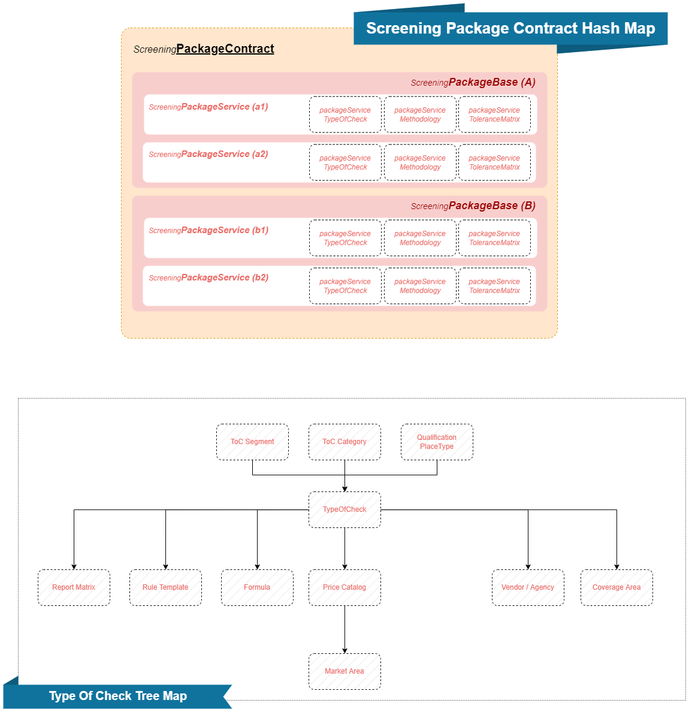

# TOC Management Flow

This schema consists of two main parts: the **Screening Package Contract Hash Map** and the **Type of Check Tree Map**. Here's a simplified explanation for non-technical people.

---

### Screening Package Contract Hash Map

This part of the schema shows how different screening packages are structured and connected. Think of it like a menu in a restaurant, where each screening package is a meal that includes various services.

1. **Screening Package Contract**: This is like the overall menu. It lists the different screening packages available.

2. **Screening Package Base (A and B)**: These are like the main categories of meals (e.g., vegetarian and non-vegetarian). Each base has different services associated with it.

   - **Screening Package Service (a1, a2, b1, b2)**: These are individual dishes in each category. Each service includes several components:
     - **Type Of Check**: The specific type of check being performed.
     - **Methodology**: The method used to perform the check.
     - **Tolerance Matrix**: The criteria or standards used to evaluate the check.

---

### Type Of Check Tree Map

This part of the schema shows how the different types of checks are organized. It's like a decision tree that helps determine the specific type of check needed.

1. **Type Of Check**: The central point of this tree. It's the specific check you want to perform.

2. **ToC Segment, ToC Category, Qualification PlaceType**: These are categories that help classify and determine the type of check. Think of them as different branches leading to the specific check.

3. **Subcategories Under Type Of Check**:
   - **Report Matrix**: A specific type of report generated from the check.
   - **Rule Template**: The rules or guidelines used during the check.
   - **Formula**: Mathematical or logical formulas used in the check.
   - **Price Catalog**: Pricing information related to the check.
   - **Market Area**: The geographic area or market where the check is applicable.
   - **Vendor/Agency**: The organization or agency performing the check.
   - **Coverage Area**: The area covered by the check.

---

### Summary

- **Screening Package Contract Hash Map**: Describes different screening packages and their components.
- **Type Of Check Tree Map**: Shows how different types of checks are categorized and related.
