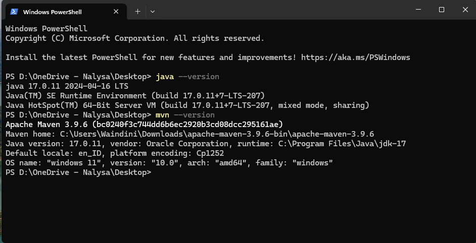

# Technology Setting Up and Installation

Set up
prepare this kind of technology:

1. java (jdk-17)
2. apache - maven
3. dbEaver database
4. mySQL
5. idealC - for the Java IDE

step of installation and settip up project :

1. install all of those mentioned applications above
2. special for maven and java, do not forget to adding to the environtment path untik this kind of things appeared up when you command on the terminal:
   

Clone up the application on the repository and execute using yarn package and mentioned builder on package.json
